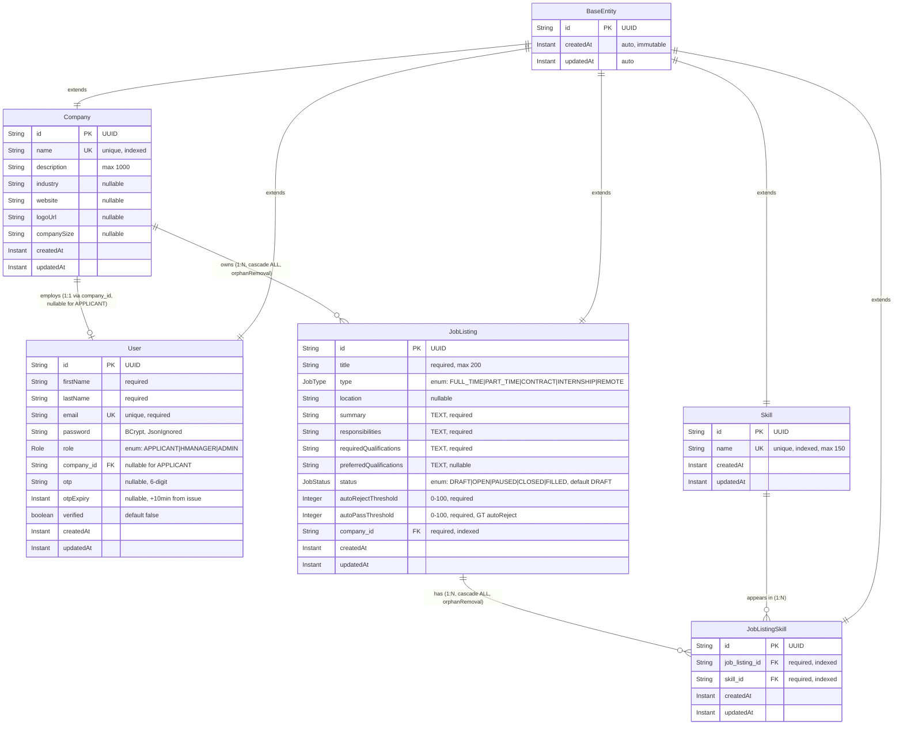

# HireFlow

> Enterprise-grade hiring platform backend built with Spring Boot 4 and Java 21.

HireFlow is a hiring management platform designed to help companies streamline their recruitment workflows — from candidate applications through interviews and offers. This repository contains the **backend service**, which exposes a REST API consumed by web and mobile clients.

---

## Table of Contents

1. [Tech Stack](#tech-stack)
2. [Features](#features)
3. [Architecture](#architecture)
4. [Project Structure](#project-structure)
5. [Getting Started](#getting-started)
6. [Configuration](#configuration)
7. [Running the App](#running-the-app)
8. [API Reference](#api-reference)
9. [Testing](#testing)
10. [Engineering Standards](#engineering-standards)
11. [Contributors](#contributors)
12. [License](#license)

---

## Tech Stack

| Layer            | Technology                                 |
|------------------|--------------------------------------------|
| Language         | Java 21                                    |
| Framework        | Spring Boot 4.0.6                          |
| Security         | Spring Security 6 + Auth0 `java-jwt` 4.5.0 |
| Persistence      | Spring Data JPA / Hibernate                |
| Database         | MySQL 8                                    |
| Mapping          | ModelMapper 3.1.1 + dedicated mappers      |
| Mail             | Spring Mail (JavaMailSender, Gmail SMTP)   |
| Async            | Spring `@Async` with custom executor       |
| Build            | Maven                                      |
| Testing          | JUnit 5, Mockito, AssertJ, MockMvc         |

---

## Features

- **JWT-based authentication** — stateless sessions, signed tokens, configurable expiration.
- **OTP email verification** — 6-digit codes, 10-minute expiry, automatic regeneration on expired-OTP login attempts.
- **Asynchronous email delivery** — emails are dispatched on a dedicated thread pool so request handlers never block on SMTP I/O.
- **Role-based access control** — `APPLICANT`, `HMANAGER`, `ADMIN`.
- **Centralised exception handling** — `@RestControllerAdvice` returns a consistent `ApiResponse` envelope for every error class.
- **Comprehensive test coverage** — every service method and controller endpoint has both unit and full-stack integration tests.

---

## Architecture

HireFlow follows a clean, layered architecture:

```
Controller  →  Service (interface)  →  Service Impl  →  Repository  →  DB
                       │
                       └→ Mapper, EmailService, JwtUtil, etc.
```

Key conventions:

- **Interface-driven services**: every service has an interface in `service/` and an implementation in `service/impl/`.
- **DTOs at the boundary**: entities never leak past the service layer — controllers consume request/response DTOs only.
- **Mappers, not builders**: object conversion lives in `@Component` mapper classes, never inline.

### Entity Relationship Diagram (Current v3.0 State)

> **MAINTENANCE RULE**: This ERD MUST be updated whenever an entity is added, removed, or its fields/relationships change. Drift between the diagram and the code is treated as a bug.

#### Visual ERD (Mermaid)



#### Detailed Entity Reference

**`BaseEntity`** *(MappedSuperclass — not a table)*
- All entities inherit: `id` (UUID, PK), `createdAt` (Instant, auto, immutable), `updatedAt` (Instant, auto)

---

**`companies`** — root tenant entity
| Column | Type | Constraint | Notes |
|---|---|---|---|
| `id` | UUID | PK | inherited |
| `name` | VARCHAR | UNIQUE, NOT NULL, indexed (`idx_company_name`) | tenant identifier |
| `description` | VARCHAR(1000) | nullable | |
| `industry` | VARCHAR | nullable | e.g., "Tech", "Finance" |
| `website` | VARCHAR | nullable | URL |
| `logoUrl` | VARCHAR | nullable | URL |
| `companySize` | VARCHAR | nullable | e.g., "1-50", "50-100" |
| `createdAt`, `updatedAt` | TIMESTAMP | NOT NULL | inherited |

Relationships:
- `Company 1 ──< JobListing` (`@OneToMany`, `mappedBy="company"`, cascade ALL, orphanRemoval)
- `User many ─> Company` (FK on `User.company_id`)

---

**`users`** — RBAC subject
| Column | Type | Constraint | Notes |
|---|---|---|---|
| `id` | UUID | PK | inherited |
| `firstName` | VARCHAR | NOT NULL | |
| `lastName` | VARCHAR | NOT NULL | |
| `email` | VARCHAR | UNIQUE, NOT NULL | login identifier |
| `password` | VARCHAR | NOT NULL, `@JsonIgnore` | BCrypt hash |
| `role` | ENUM (STRING) | NOT NULL | `APPLICANT`, `HMANAGER`, `ADMIN` |
| `company_id` | UUID | FK → `companies.id`, nullable | `APPLICANT` may be null |
| `otp` | VARCHAR | nullable | 6-digit verification code |
| `otpExpiry` | TIMESTAMP | nullable | issued + 10 minutes |
| `verified` | BOOLEAN | NOT NULL, default `false` | gates login |
| `createdAt`, `updatedAt` | TIMESTAMP | NOT NULL | inherited |

Relationships:
- `User many ─> Company` (`@OneToOne(fetch=LAZY)`, `@JoinColumn(name="company_id", nullable=true)`)
- Note: `Company` does NOT hold a back-reference to `User`

---

**`job_listings`** — postings owned by a Company
| Column | Type | Constraint | Notes |
|---|---|---|---|
| `id` | UUID | PK | inherited |
| `title` | VARCHAR | NOT NULL | |
| `type` | ENUM (STRING) | NOT NULL | `FULL_TIME`, `PART_TIME`, `CONTRACT`, `INTERNSHIP`, `REMOTE` |
| `location` | VARCHAR | nullable | |
| `summary` | TEXT | NOT NULL | long-form pitch |
| `responsibilities` | TEXT | NOT NULL | long-form |
| `requiredQualifications` | TEXT | NOT NULL | long-form |
| `preferredQualifications` | TEXT | nullable | long-form |
| `status` | ENUM (STRING) | NOT NULL, default `DRAFT` | `DRAFT`, `OPEN`, `PAUSED`, `CLOSED`, `FILLED` |
| `autoRejectThreshold` | INT | NOT NULL | 0–100 |
| `autoPassThreshold` | INT | NOT NULL | 0–100, must be `>` autoRejectThreshold (service-validated) |
| `company_id` | UUID | FK → `companies.id`, NOT NULL, `@JsonIgnore` | tenant FK |
| `createdAt`, `updatedAt` | TIMESTAMP | NOT NULL | inherited |

Indexes: `idx_job_company` on `company_id`, `idx_job_status` on `status`

Relationships:
- `JobListing many ─> Company` (`@ManyToOne(fetch=LAZY)`, NOT NULL)
- `JobListing 1 ──< JobListingSkill` (`@OneToMany`, `mappedBy="jobListing"`, cascade ALL, orphanRemoval)

---

**`job_listing_skills`** — manual join table (NOT `@ManyToMany`)
| Column | Type | Constraint | Notes |
|---|---|---|---|
| `id` | UUID | PK | inherited |
| `job_listing_id` | UUID | FK → `job_listings.id`, NOT NULL, `@JsonIgnore` | back-reference |
| `skill_id` | UUID | FK → `skills.id`, NOT NULL | |
| `createdAt`, `updatedAt` | TIMESTAMP | NOT NULL | inherited |

Constraints: `UNIQUE (job_listing_id, skill_id)` — `uk_jls_job_skill` (no duplicate skill links)
Indexes: `idx_jls_job` on `job_listing_id`, `idx_jls_skill` on `skill_id`

Relationships:
- `JobListingSkill many ─> JobListing` (`@ManyToOne(fetch=LAZY)`, NOT NULL)
- `JobListingSkill many ─> Skill` (`@ManyToOne(fetch=LAZY)`, NOT NULL)

---

**`skills`** — global lookup table
| Column | Type | Constraint | Notes |
|---|---|---|---|
| `id` | UUID | PK | inherited |
| `name` | VARCHAR(150) | UNIQUE, NOT NULL, indexed (`idx_skill_name`) | case-insensitive unique via `findByNameIgnoreCase` |
| `createdAt`, `updatedAt` | TIMESTAMP | NOT NULL | inherited |

Relationships:
- `Skill 1 ──< JobListingSkill` (referenced by join table)
- *(Future)* `Skill <─> Application`, `Skill <─> ResumeProfile` via additional join tables

---

#### Cardinality Summary

| Relationship | Cardinality | Owning Side | Cascade |
|---|---|---|---|
| Company → JobListing | 1 : N | `JobListing.company` | ALL, orphanRemoval |
| Company → User | 1 : 0..1 (per current code) | `User.company` | none |
| JobListing → JobListingSkill | 1 : N | `JobListingSkill.jobListing` | ALL, orphanRemoval |
| Skill → JobListingSkill | 1 : N | `JobListingSkill.skill` | none (skills outlive job links) |

#### Planned Entities (v3.1+)

`Application`, `ResumeProfile`, `Education`, `WorkExperience`, `AIScreeningResult`, `InterviewSlot`, `StageUpdate` —


---

## Project Structure

```
src/main/java/com/hireflow/hireflow
├── HireflowApplication.java
├── config              # AsyncConfig, SecurityConfig, MapperConfig
├── controller          # REST endpoints
├── data
│   ├── model           # JPA entities + BaseEntity (UUID + audit timestamps)
│   └── repository      # Spring Data JPA repositories
├── dto
│   ├── request         # Validated request payloads
│   └── response        # ApiResponse<T>, AuthResponse, ...
├── enums               # Role, etc.
├── exception           # Custom exceptions + GlobalExceptionHandler
├── mapper              # Entity ↔ DTO conversion
├── security
│   ├── filter          # JwtAuthenticationFilter
│   ├── service         # UserPrincipalService
│   └── util            # JwtUtil
└── service
    ├── AuthService, EmailService, UserService     # interfaces
    └── impl                                       # implementations
```

---

## Getting Started

### Prerequisites

- **JDK 21** (any Temurin/Adoptium 21 build is fine)
- **Maven 3.9+**
- **MySQL 8** running locally (or accessible remotely)
- **A Gmail account with an [App Password](https://support.google.com/accounts/answer/185833)** for outbound SMTP

### Clone & install

```bash
git clone https://github.com/<your-org>/hireflow.git
cd hireflow
mvn clean install -DskipTests
```

### Create the databases

```sql
CREATE DATABASE hireflow;
CREATE DATABASE hireflow_test_db;
```

---

## Configuration

Secrets and environment-specific values are kept out of source control in `src/main/resources/env.properties`, which is git-ignored. A template is committed at `env-examples.properties` — copy it and fill in your values:

```bash
cp src/main/resources/env-examples.properties src/main/resources/env.properties
```

`env.properties`:

```properties
DB_USERNAME=root
DB_PASSWORD=your_db_password
DB_URL=jdbc:mysql://localhost:3306/hireflow
DB_URL_TEST=jdbc:mysql://localhost:3306/hireflow_test_db
JWT_SECRET=at-least-256-bits-of-secret-material
JWT_EXPIRATION=86400000
MAIL_USERNAME=your.email@gmail.com
MAIL_PASSWORD=your_gmail_app_password
```

> **Gmail note:** The `MAIL_PASSWORD` must be a Gmail **App Password** (16 chars, no spaces). Regular account passwords will be rejected by Google's SMTP since 2022.

---

## Running the App

```bash
mvn spring-boot:run
```

The API boots on `http://localhost:8080`.

---

## API Reference

All endpoints are prefixed with `/api/v1`. Successful responses follow:

```json
{ "success": true, "message": "...", "data": { ... } }
```

Errors:

```json
{ "success": false, "message": "..." }
```

### Auth

| Method | Path                    | Description                                              | Auth        |
|--------|-------------------------|----------------------------------------------------------|-------------|
| POST   | `/api/v1/auth/register` | Register a new user; sends OTP to email.                 | Public      |
| POST   | `/api/v1/auth/verify-otp` | Verify the OTP and activate the account.              | Public      |
| POST   | `/api/v1/auth/login`    | Authenticate and receive a JWT.                          | Public      |

#### Login behaviour for unverified accounts

When an unverified user attempts to log in, the API returns **403 Forbidden** with one of two messages:

- `"Please verify your email. Enter the OTP sent to your inbox."` — the existing OTP is still valid.
- `"Your OTP has expired. A new OTP has been sent to your email."` — the previous OTP expired; a fresh one has been generated, persisted, and emailed.

---

## Testing

Tests use a separate MySQL schema (`hireflow_test_db`) configured via `src/test/resources/application-test.properties`. The test profile drops and recreates the schema for each run.

Run everything:

```bash
mvn test
```

Run a single test class:

```bash
mvn test -Dtest=AuthServiceImplTest
```

### Coverage policy

- **Every** service method has a Mockito-based unit test covering happy path, validation failures, and exceptional flows.
- **Every** controller endpoint has a `@SpringBootTest` integration test that exercises the full controller → service → repository → DB chain via `MockMvc`.
- The mailer is mocked with `@MockBean JavaMailSender` in integration tests so test runs never connect to SMTP.

---

## Engineering Standards

Key conventions:

- Interface-driven services (`Controller → Service → ServiceImpl → Repository`)
- UUID primary keys, audit timestamps via `BaseEntity`
- `@Enumerated(EnumType.STRING)` for all enums
- No `@Builder` and no `@Data` — use plain constructors, getters, setters, and dedicated mappers
- Centralised exception handling with a consistent envelope
- `@Async` invocations are always called outside a `@Transactional` boundary

---

## Contributors

| Name             | Role          | GitHub                                          |
|------------------|---------------|-------------------------------------------------|
| Ademeso Josiah   | Maintainer    | [@ademesojosiah](https://github.com/ademesojosiah) |
| Praise Bakare    | Contributor   | [@praisebakare](https://github.com/praisebakare)   |

Contributions are welcome — please ensure all tests pass before opening a PR.

---

## License

Proprietary — all rights reserved by the HireFlow team. See `LICENSE` for details.
