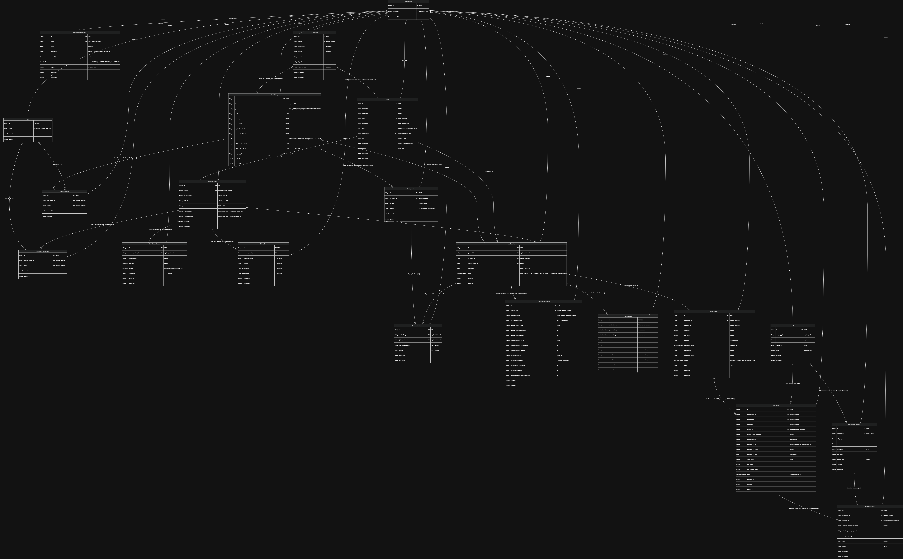

# HireFlow

> Enterprise-grade hiring platform backend built with Spring Boot 4 and Java 21.

HireFlow is a hiring management platform designed to help companies streamline their recruitment workflows — from candidate applications through interviews and offers. This repository is the **Application Service** — the only one of the three HireFlow services that owns a database and exposes the public REST API consumed by web and mobile clients.

## Related Services

| Service | Repository | Role |
|---|---|---|
| **Application Service** *(this repo)* | https://github.com/ademesojosiah/hireflow | Owns the database; exposes REST API; publishes domain events |
| AI Screening Service | https://github.com/ademesojosiah/ai-Screening | Stateless worker; consumes `ApplicationSubmitted`; publishes screening results |
| Notification Service | https://github.com/ademesojosiah/notification | Stateless worker; consumes `EmailNotificationEvent`; sends email + SSE |

All three services connect to the same Confluent Cloud Kafka cluster (SASL_SSL + PLAIN). Only this service holds persistent data.

---

## Table of Contents

1. [Tech Stack](#tech-stack)
2. [Features](#features)
3. [Architecture](#architecture)
4. [Project Structure](#project-structure)
5. [Getting Started](#getting-started)
6. [Configuration](#configuration)
7. [Running the App](#running-the-app)
8. [API Reference](#api-reference)
9. [Testing](#testing)
10. [Technical Decisions](#technical-decisions)
11. [Engineering Standards](#engineering-standards)
12. [Contributors](#contributors)
13. [License](#license)

---

## Tech Stack

| Layer            | Technology                                 |
|------------------|--------------------------------------------|
| Language         | Java 21                                    |
| Framework        | Spring Boot 4.0.6                          |
| Security         | Spring Security 6 + Auth0 `java-jwt` 4.5.0 |
| Persistence      | Spring Data JPA / Hibernate                |
| Database         | MySQL 8 (local dev) / AWS RDS (deployed)   |
| Cache            | Redis (managed; Redis Cloud / ElastiCache) via Spring Cache + Lettuce |
| Mapping          | ModelMapper 3.1.1 + dedicated mappers      |
| Messaging        | Spring Kafka against Confluent Cloud (SASL_SSL + PLAIN) |
| Notifications    | Kafka events to Notification service       |
| Async            | Spring `@Async` with custom executor       |
| Build            | Maven                                      |
| Container        | Multi-stage Docker (Temurin 21 JRE runtime, non-root) |
| Testing          | JUnit 5, Mockito, AssertJ, MockMvc         |

---

## Features

- **JWT-based authentication** — stateless sessions, signed tokens, configurable expiration.
- **OTP email verification** — 6-digit codes, 10-minute expiry, automatic regeneration on expired-OTP login attempts.
- **Invite-based HMANAGER onboarding** — admins invite hiring managers by email; the invitee receives a secure token link (72-hour expiry) to create their account. `HMANAGER` and `ADMIN` roles are blocked from self-registration.
- **Kafka-backed notifications** — email requests are emitted as notification events for the Notification service; request handlers never send SMTP directly.
- **Role-based access control** — `APPLICANT`, `HMANAGER`, `ADMIN`.
- **Candidate applications** — applicants can apply to open jobs, answer role-specific technical questions, see their applications, and hiring teams can list applications by job.
- **Per-stage AI screening** — application submission triggers four independent AI screening stages (resume analysis, project consistency, inconsistency review, match summary), each publishing its own Kafka event and updating the screening result row partially as results arrive. The AI Screening Service uses Gemini with a deterministic keyword-based fallback.
- **Transparent application updates** — application stage transitions publish notification events to Kafka; the Notification service sends emails and broadcasts SSE updates to connected applicants in real time.
- **Interview scheduling** - hiring teams schedule, reschedule, and cancel interviews with a Meet-shaped link generated by the pluggable `MeetingLinkProvider`. The current implementation is a stub that returns a random Meet-formatted URL; replace with a real conferencing provider when ready. Scheduling is the only path into `INTERVIEW_SCHEDULED`.
- **Admin metrics** — per-company application volume by stage and time-to-hire (mean / median / p95 / min / max) endpoints, with optional `jobListingId` filter. Backed by JPQL aggregation projections.
- **Redis caching** — Spring Cache + Lettuce against managed Redis. Read-heavy endpoints (`findById`, public job feed, admin metrics) are `@Cacheable`; mutating operations evict the keys they touch via `@CacheEvict`.
- **Structured scorecards** - admins manage company scorecard templates; hiring managers submit one scorecard each for company interviews, while admins and hiring managers can read all company scorecards. A submitted scorecard is required before moving an application from `INTERVIEW_SCHEDULED` to `OFFER_SENT`.
- **Stage audit actor capture** - every application status update records the actor string plus structured `actorId`, `actorEmail`, and `actorRole` fields for future general audit expansion.
- **Role-specific job questions** — admins and hiring managers can add technical questions with internal answer guides when creating or updating a job; guides are stored for human review but are not forwarded to AI screening.
- **Direct-to-Cloudinary signed uploads** — the backend generates a short-lived Cloudinary signature; the frontend uploads the file directly to Cloudinary and sends back only the resulting URL. The server never handles the file bytes.
- **Centralised exception handling** — `@RestControllerAdvice` returns a consistent `ApiResponse` envelope for every error class.
- **Comprehensive test coverage** — every service method and controller endpoint has both unit and full-stack integration tests.

---

## Architecture

### Layered Architecture (within this service)

```
Controller  →  Service (interface)  →  Service Impl  →  Repository  →  MySQL
                       │                       │
                       │                       └→ Spring Cache (Redis)
                       └→ Mapper, Kafka producers/consumers, JwtUtil,
                          MeetingLinkProvider (stub), CloudinarySigner, ...
```

Key conventions:

- **Interface-driven services**: every service has an interface in `service/` and an implementation in `service/impl/`.
- **DTOs at the boundary**: entities never leak past the service layer — controllers consume request/response DTOs only.
- **Mappers, not builders**: object conversion lives in `@Component` mapper classes, never inline.
- **Pluggable integration boundaries**: external services live behind interfaces (`MeetingLinkProvider`, upload signer, JWT util) so the stub-vs-real swap is a one-line bean change.

### Microservices Topology

HireFlow runs as three independently deployed services. Only this one owns a database — the others are stateless workers that retry through Kafka.

```
┌──────────────────────────────────────────────────────────────────┐
│            Application Service  (this repo — owns DB)            │
│  users · companies · job_listings · resume_profiles              │
│  applications · ai_screening_results · interview_slots           │
│  scorecards · stage_updates · hmanager_invitations               │
│  ─────────────────────────────────────────────────────────────── │
│  ← Spring Cache → Redis (managed: Redis Cloud / ElastiCache)     │
└──────────────┬──────────────────────────────┬────────────────────┘
               │                              │
               │  Confluent Cloud Kafka       │
               │  (SASL_SSL + PLAIN)          │
               ▼                              ▼
┌──────────────────────────────┐   ┌──────────────────────────────┐
│  AI Screening Service        │   │   Notification Service       │
│  (stateless worker — no DB)  │   │   (stateless worker — no DB) │
│  Gemini + deterministic      │   │   Gmail SMTP  +  SSE         │
│  fallback per stage          │   │   broadcast to applicants    │
└──────────────────────────────┘   └──────────────────────────────┘
```

#### Service Breakdown

| Service | Owns DB | Inputs (Kafka in) | Outputs (Kafka out) | Other I/O |
|---|---|---|---|---|
| **Application Service** | MySQL | All `*CompletedEvent`s from AI Screening | `ApplicationSubmittedEvent`, `EmailNotificationEvent` | REST API to clients; signed Cloudinary uploads |
| **AI Screening Service** | none | `ApplicationSubmittedEvent` | `ResumeAnalysisCompletedEvent`, `ProjectConsistencyCompletedEvent`, `InconsistencyReviewCompletedEvent`, `ScreeningCompletedEvent` | Gemini REST API (OpenAI-compatible endpoint) |
| **Notification Service** | none | `EmailNotificationEvent` | none | Gmail SMTP; SSE stream to applicants |

#### Kafka Event Catalogue

- `ApplicationSubmittedEvent` — Application Service → AI Screening (one event per submitted application)
- `ResumeAnalysisCompletedEvent`, `ProjectConsistencyCompletedEvent`, `InconsistencyReviewCompletedEvent`, `ScreeningCompletedEvent` — AI Screening → Application Service (four parallel partial-update events per application)
- `EmailNotificationEvent` (types: `OTP_VERIFICATION`, `COMPANY_WELCOME`, `APPLICATION_STAGE_UPDATED`, `HMANAGER_INVITE`) — Application Service → Notification Service

Each AI screening event updates only its own fields on `AiScreeningResult` — partial results arrive and are persisted independently as stages complete. If a worker fails, Kafka retries the message; if the failure must be recorded (e.g. `ScreeningFailed`), the worker publishes an event and the Application Service writes the result.

### Entity Relationship Diagram (Current State)

> **MAINTENANCE RULE**: This ERD MUST be updated whenever an entity is added, removed, or its fields/relationships change. Drift between the diagram and the code is treated as a bug.

#### Visual ERD



> The Mermaid source for this diagram lives in [`GENERAL_ENTITY_RULES.md`](GENERAL_ENTITY_RULES.md#entity-relationship-diagram-mermaid-source). Re-export `docs/erd.png` from that source after any schema change.
>
> Every entity inherits `id` (UUID PK), `createdAt`, and `updatedAt` from `BaseEntity` (`@MappedSuperclass` — no table).

#### Detailed Entity Reference

**`BaseEntity`** *(MappedSuperclass — not a table)*
- All entities inherit: `id` (UUID, PK), `createdAt` (Instant, auto, immutable), `updatedAt` (Instant, auto)

---

**`companies`** — root tenant entity
| Column | Type | Constraint | Notes |
|---|---|---|---|
| `id` | UUID | PK | inherited |
| `name` | VARCHAR | UNIQUE, NOT NULL, indexed (`idx_company_name`) | tenant identifier |
| `description` | VARCHAR(1000) | nullable | |
| `industry` | VARCHAR | nullable | e.g., "Tech", "Finance" |
| `website` | VARCHAR | nullable | URL |
| `logoUrl` | VARCHAR | nullable | URL |
| `companySize` | VARCHAR | nullable | e.g., "1-50", "50-100" |
| `createdAt`, `updatedAt` | TIMESTAMP | NOT NULL | inherited |

Relationships:
- `Company 1 ──< JobListing` (`@OneToMany`, `mappedBy="company"`, cascade ALL, orphanRemoval)
- `Company 1 ──< User` (FK on `User.company_id`; `User` side is `@ManyToOne` — one admin + many HMANAGERs per company)

---

**`users`** — RBAC subject
| Column | Type | Constraint | Notes |
|---|---|---|---|
| `id` | UUID | PK | inherited |
| `firstName` | VARCHAR | NOT NULL | |
| `lastName` | VARCHAR | NOT NULL | |
| `email` | VARCHAR | UNIQUE, NOT NULL | login identifier |
| `password` | VARCHAR | NOT NULL, `@JsonIgnore` | BCrypt hash |
| `role` | ENUM (STRING) | NOT NULL | `APPLICANT`, `HMANAGER`, `ADMIN` |
| `company_id` | UUID | FK → `companies.id`, nullable | `APPLICANT` may be null |
| `otp` | VARCHAR | nullable | 6-digit verification code |
| `otpExpiry` | TIMESTAMP | nullable | issued + 10 minutes |
| `verified` | BOOLEAN | NOT NULL, default `false` | gates login |
| `createdAt`, `updatedAt` | TIMESTAMP | NOT NULL | inherited |

Relationships:
- `User 1 ──1 ResumeProfile` (FK sits on `resume_profiles.user_id`; `User` holds no back-reference)

---

**`job_listings`** — postings owned by a Company
| Column | Type | Constraint | Notes |
|---|---|---|---|
| `id` | UUID | PK | inherited |
| `title` | VARCHAR | NOT NULL | |
| `type` | ENUM (STRING) | NOT NULL | `FULL_TIME`, `PART_TIME`, `CONTRACT`, `INTERNSHIP`, `REMOTE` |
| `location` | VARCHAR | nullable | |
| `summary` | TEXT | NOT NULL | long-form pitch |
| `responsibilities` | TEXT | NOT NULL | long-form |
| `requiredQualifications` | TEXT | NOT NULL | long-form |
| `preferredQualifications` | TEXT | nullable | long-form |
| `status` | ENUM (STRING) | NOT NULL, default `DRAFT` | `DRAFT`, `OPEN`, `PAUSED`, `CLOSED`, `FILLED` |
| `autoRejectThreshold` | INT | NOT NULL | 0–100 |
| `autoPassThreshold` | INT | NOT NULL | 0–100, must be `>` autoRejectThreshold (service-validated) |
| `company_id` | UUID | FK → `companies.id`, NOT NULL, `@JsonIgnore` | tenant FK |
| `createdAt`, `updatedAt` | TIMESTAMP | NOT NULL | inherited |

Indexes: `idx_job_company` on `company_id`, `idx_job_status` on `status`

Relationships:
- `JobListing many ─> Company` (`@ManyToOne(fetch=LAZY)`, NOT NULL)
- `JobListing 1 ──< JobListingSkill` (`@OneToMany`, `mappedBy="jobListing"`, cascade ALL, orphanRemoval)
- `JobListing 1 ──< JobQuestion` (`@OneToMany`, `mappedBy="jobListing"`, cascade ALL, orphanRemoval)
- `JobListing 1 ──< Application` (applications reference the job through `Application.jobListing`)

---

**`job_listing_skills`** — manual join table (NOT `@ManyToMany`)
| Column | Type | Constraint | Notes |
|---|---|---|---|
| `id` | UUID | PK | inherited |
| `job_listing_id` | UUID | FK → `job_listings.id`, NOT NULL, `@JsonIgnore` | back-reference |
| `skill_id` | UUID | FK → `skills.id`, NOT NULL | |
| `createdAt`, `updatedAt` | TIMESTAMP | NOT NULL | inherited |

Constraints: `UNIQUE (job_listing_id, skill_id)` — `uk_jls_job_skill`
Indexes: `idx_jls_job` on `job_listing_id`, `idx_jls_skill` on `skill_id`

Relationships:
- `JobListingSkill many ─> JobListing` (`@ManyToOne(fetch=LAZY)`, NOT NULL)
- `JobListingSkill many ─> Skill` (`@ManyToOne(fetch=LAZY)`, NOT NULL)

---

**`job_questions`** — role-specific technical questions owned by a job listing
| Column | Type | Constraint | Notes |
|---|---|---|---|
| `id` | UUID | PK | inherited |
| `job_listing_id` | UUID | FK -> `job_listings.id`, NOT NULL, indexed (`idx_job_question_job`) | back-reference |
| `question` | TEXT | NOT NULL | candidate-facing prompt |
| `answer` | TEXT | NOT NULL | internal answer guide; not exposed in public/job responses |
| `createdAt`, `updatedAt` | TIMESTAMP | NOT NULL | inherited |

Relationships:
- `JobQuestion many -> JobListing` (`@ManyToOne(fetch=LAZY)`, NOT NULL)
- `JobListing 1:N JobQuestion` is managed through cascade ALL and orphanRemoval.
- `JobQuestion 1:N ApplicationAnswer` captures submitted applicant responses.

Service rule: job questions are intentionally simple. Create/update accepts `question` + `answer`; updating a job with a non-null `questions` list replaces the existing child list.

---

**`skills`** — global lookup table (curated by ADMIN/HMANAGER; applicants attach by ID only)
| Column | Type | Constraint | Notes |
|---|---|---|---|
| `id` | UUID | PK | inherited |
| `name` | VARCHAR(150) | UNIQUE, NOT NULL, indexed (`idx_skill_name`) | case-insensitive unique via `findByNameIgnoreCase` |
| `createdAt`, `updatedAt` | TIMESTAMP | NOT NULL | inherited |

Relationships:
- `Skill 1 ──< JobListingSkill` (referenced by job listing join table)
- `Skill 1 ──< ResumeProfileSkill` (referenced by resume profile join table)

---

**`resume_profiles`** — applicant's professional profile (one per user)
| Column | Type | Constraint | Notes |
|---|---|---|---|
| `id` | UUID | PK | inherited |
| `user_id` | UUID | FK → `users.id`, UNIQUE, NOT NULL, indexed (`idx_resume_profile_user`) | one profile per applicant |
| `phoneNumber` | VARCHAR | nullable | max 30 chars |
| `linkedIn` | VARCHAR | nullable | max 300 chars |
| `summary` | TEXT | nullable | professional summary |
| `resumePdfUrl` | VARCHAR(2000) | nullable | Cloudinary `secure_url` returned after direct upload |
| `resumePublicId` | VARCHAR(500) | nullable | Cloudinary `public_id` — used to delete/replace the file |
| `createdAt`, `updatedAt` | TIMESTAMP | NOT NULL | inherited |

Constraints: `uk_resume_profile_user` on `user_id`

Relationships:
- `ResumeProfile 1 ─> User` (`@OneToOne(fetch=LAZY)`, FK on this table)
- `ResumeProfile 1 ──< ResumeProfileSkill` (`@OneToMany`, cascade ALL, orphanRemoval)
- `ResumeProfile 1 ──< WorkExperience` (`@OneToMany`, cascade ALL, orphanRemoval)
- `ResumeProfile 1 ──< Education` (`@OneToMany`, cascade ALL, orphanRemoval)

---

**`resume_profile_skills`** — manual join table linking a profile to curated skills
| Column | Type | Constraint | Notes |
|---|---|---|---|
| `id` | UUID | PK | inherited |
| `resume_profile_id` | UUID | FK → `resume_profiles.id`, NOT NULL, `@JsonIgnore` | back-reference |
| `skill_id` | UUID | FK → `skills.id`, NOT NULL | |
| `createdAt`, `updatedAt` | TIMESTAMP | NOT NULL | inherited |

Constraints: `UNIQUE (resume_profile_id, skill_id)` — `uk_rps_profile_skill`
Indexes: `idx_rps_profile` on `resume_profile_id`, `idx_rps_skill` on `skill_id`

Relationships:
- `ResumeProfileSkill many ─> ResumeProfile` (`@ManyToOne(fetch=LAZY)`, `@JsonIgnore`)
- `ResumeProfileSkill many ─> Skill` (`@ManyToOne(fetch=LAZY)`)

---

**`work_experiences`** — career history entries owned by a resume profile
| Column | Type | Constraint | Notes |
|---|---|---|---|
| `id` | UUID | PK | inherited |
| `resume_profile_id` | UUID | FK → `resume_profiles.id`, NOT NULL, `@JsonIgnore`, indexed (`idx_work_experience_profile`) | back-reference |
| `companyName` | VARCHAR | NOT NULL | |
| `startDate` | DATE | NOT NULL | `LocalDate` |
| `endDate` | DATE | nullable | null = current role |
| `experience` | TEXT | nullable | HTML-friendly description |
| `createdAt`, `updatedAt` | TIMESTAMP | NOT NULL | inherited |

Service rule: `endDate`, when present, must be ≥ `startDate` (validated before persist).

Relationships:
- `WorkExperience many ─> ResumeProfile` (`@ManyToOne(fetch=LAZY)`, `@JsonIgnore`)

---

**`educations`** — academic history entries owned by a resume profile
| Column | Type | Constraint | Notes |
|---|---|---|---|
| `id` | UUID | PK | inherited |
| `resume_profile_id` | UUID | FK → `resume_profiles.id`, NOT NULL, `@JsonIgnore`, indexed (`idx_education_profile`) | back-reference |
| `institutionName` | VARCHAR | NOT NULL | |
| `degree` | VARCHAR | NOT NULL | e.g., "B.Sc Computer Science" |
| `startDate` | DATE | NOT NULL | `LocalDate` |
| `endDate` | DATE | nullable | null = ongoing |
| `createdAt`, `updatedAt` | TIMESTAMP | NOT NULL | inherited |

Service rule: `endDate`, when present, must be ≥ `startDate`.

Relationships:
- `Education many ─> ResumeProfile` (`@ManyToOne(fetch=LAZY)`, `@JsonIgnore`)

---

**`applications`** — candidate application records
| Column | Type | Constraint | Notes |
|---|---|---|---|
| `id` | UUID | PK | inherited |
| `applicant_id` | UUID | FK -> `users.id`, NOT NULL, indexed | applicant user |
| `job_listing_id` | UUID | FK -> `job_listings.id`, NOT NULL, indexed | target job |
| `resume_profile_id` | UUID | FK -> `resume_profiles.id`, NOT NULL | resume snapshot source for screening |
| `company_id` | UUID/String | NOT NULL, indexed (`idx_application_company`) | denormalized tenant boundary from job company |
| `stage` | ENUM (STRING) | NOT NULL | `APPLIED`, `SCREENING`, `INTERVIEW_SCHEDULED`, `OFFER_SENT`, `HIRED`, `REJECTED` |
| `createdAt`, `updatedAt` | TIMESTAMP | NOT NULL | inherited |

Constraints: `UNIQUE (applicant_id, job_listing_id)` — `uk_application_applicant_job`

Relationships:
- `Application many -> User` through `applicant`
- `Application many -> JobListing`
- `Application many -> ResumeProfile`
- `Application 1:N ApplicationAnswer` (`@OneToMany`, cascade ALL, orphanRemoval)
- `Application 1:N StageUpdate` (`@OneToMany`, cascade ALL, orphanRemoval)
- `Application 1:0..1 AiScreeningResult` (`@OneToOne`, cascade ALL, orphanRemoval)

---

**`application_answers`** — applicant answers to job-specific technical questions
| Column | Type | Constraint | Notes |
|---|---|---|---|
| `id` | UUID | PK | inherited |
| `application_id` | UUID | FK -> `applications.id`, NOT NULL, indexed (`idx_application_answer_application`) | parent application |
| `job_question_id` | UUID | FK -> `job_questions.id`, NOT NULL, indexed (`idx_application_answer_job_question`) | source question |
| `questionSnapshot` | TEXT | NOT NULL | immutable copy of the prompt at submission time |
| `answer` | TEXT | NOT NULL | applicant's submitted answer |
| `createdAt`, `updatedAt` | TIMESTAMP | NOT NULL | inherited |

Constraints: `UNIQUE (application_id, job_question_id)` — `uk_application_answer_question`

Relationships:
- `ApplicationAnswer many -> Application` (`@ManyToOne(fetch=LAZY)`, `@JsonIgnore`)
- `ApplicationAnswer many -> JobQuestion` (`@ManyToOne(fetch=LAZY)`)

Service rule: applicants must answer every question attached to the target job, and submitted answers may not reference unknown question IDs. Answers stay in the Application Service database for human review and are not included in `ApplicationSubmittedEvent`.

---

**`ai_screening_results`** — normalized AI screening result for an application
| Column | Type | Constraint | Notes |
|---|---|---|---|
| `id` | UUID | PK | inherited |
| `application_id` | UUID | FK -> `applications.id`, UNIQUE, NOT NULL, indexed | one active result per application |
| `matchPercentage` | INT | nullable, 0-100 | final screening score used for automatic stage thresholds |
| `aiNarrativeSummary` | TEXT | nullable | internal-only screening explanation |
| `resumeAnalysisScore` | INT | nullable, 0-100 | resume/job analysis score |
| `resumeAnalysisExplanation` | TEXT | nullable | resume/job analysis explanation |
| `resumeAnalysisReview` | TEXT | nullable | HR-facing review note |
| `projectConsistencyScore` | INT | nullable, 0-100 | project evidence alignment score |
| `projectConsistencyExplanation` | TEXT | nullable | project consistency explanation |
| `projectConsistencyReview` | TEXT | nullable | HR-facing review note |
| `inconsistencyScore` | INT | nullable, 0-100 | risk score; higher means more inconsistency risk |
| `inconsistencySeverity` | VARCHAR | nullable | `LOW`, `MEDIUM`, `HIGH` |
| `inconsistencyExplanation` | TEXT | nullable | contradiction/evidence explanation |
| `inconsistencyReview` | TEXT | nullable | HR-facing review note |
| `recommendedHumanReviewAction` | TEXT | nullable | next action for reviewers |
| `createdAt`, `updatedAt` | TIMESTAMP | NOT NULL | inherited |

Element collections:
- `ai_screening_matched_skills(result_id, skill)`
- `ai_screening_unmatched_skills(result_id, skill)`

Rule: only `matchPercentage` controls automatic screening thresholds. Project consistency and inconsistency outputs are review inputs and must not silently reject applicants.

---

**`stage_updates`** — application stage audit entries
| Column | Type | Constraint | Notes |
|---|---|---|---|
| `id` | UUID | PK | inherited |
| `application_id` | UUID | FK -> `applications.id`, NOT NULL, indexed (`idx_stage_update_application`) | parent application |
| `previousStage` | ENUM (STRING) | nullable | null for first audit entry |
| `currentStage` | ENUM (STRING) | NOT NULL | stage after the transition |
| `reason` | VARCHAR | NOT NULL | human-readable transition reason |
| `actor` | VARCHAR | NOT NULL | user email or system actor |
| `actor_id` | UUID/String | nullable | user ID for the HR/applicant actor; null for system actors |
| `actor_email` | VARCHAR | nullable | email for the actor; stored separately for future audit queries |
| `actor_role` | ENUM (STRING) | nullable | `APPLICANT`, `HMANAGER`, or `ADMIN`; null for system actors |
| `createdAt`, `updatedAt` | TIMESTAMP | NOT NULL | inherited |

Relationships:
- `StageUpdate many -> Application` (`@ManyToOne(fetch=LAZY)`, `@JsonIgnore`)

Rule: `StageUpdate` is append-only audit data. Every applicant-facing status change records the action reason and the person who made it. HR actions store `actorId`, `actorEmail`, and `actorRole` so the future general audit log can link application status changes back to the acting user.

---

#### Cardinality Summary

| Relationship | Cardinality | Owning Side | Cascade |
|---|---|---|---|
| Company → JobListing | 1 : N | `JobListing.company` | ALL, orphanRemoval |
| Company → User | 1 : N (admin + HMANAGERs per company; APPLICANT has nullable `company_id`) | `User.company` (`@ManyToOne`) | none |
| JobListing → JobListingSkill | 1 : N | `JobListingSkill.jobListing` | ALL, orphanRemoval |
| JobListing → JobQuestion | 1 : N | `JobQuestion.jobListing` | ALL, orphanRemoval |
| JobListing → Application | 1 : N | `Application.jobListing` | none |
| JobQuestion → ApplicationAnswer | 1 : N | `ApplicationAnswer.jobQuestion` | none |
| Skill → JobListingSkill | 1 : N | `JobListingSkill.skill` | none |
| User → ResumeProfile | 1 : 0..1 | `ResumeProfile.user` (FK on weaker side) | none |
| User → Application | 1 : N | `Application.applicant` | none |
| ResumeProfile → Application | 1 : N | `Application.resumeProfile` | none |
| ResumeProfile → ResumeProfileSkill | 1 : N | `ResumeProfileSkill.resumeProfile` | ALL, orphanRemoval |
| ResumeProfile → WorkExperience | 1 : N | `WorkExperience.resumeProfile` | ALL, orphanRemoval |
| ResumeProfile → Education | 1 : N | `Education.resumeProfile` | ALL, orphanRemoval |
| Skill → ResumeProfileSkill | 1 : N | `ResumeProfileSkill.skill` | none |
| Application → ApplicationAnswer | 1 : N | `ApplicationAnswer.application` | ALL, orphanRemoval |
| Application → StageUpdate | 1 : N | `StageUpdate.application` | ALL, orphanRemoval |
| Application → AiScreeningResult | 1 : 0..1 | `AiScreeningResult.application` | ALL, orphanRemoval |
| Application -> InterviewSlot | 1 : N | `InterviewSlot.application` | none |
| InterviewSlot -> Scorecard | 1 : 0..N | `Scorecard.interviewSlot` | ALL, orphanRemoval |
| ScorecardTemplate -> ScorecardCriterion | 1 : N | `ScorecardCriterion.template` | ALL, orphanRemoval |
| ScorecardTemplate -> Scorecard | 1 : N | `Scorecard.template` | none |
| Scorecard -> ScorecardScore | 1 : N | `ScorecardScore.scorecard` | ALL, orphanRemoval |

---

**`interview_slots`** - scheduled interview meetings
| Column | Type | Constraint | Notes |
|---|---|---|---|
| `id` | UUID | PK | inherited |
| `application_id` | UUID | FK -> `applications.id`, NOT NULL, indexed | application being interviewed |
| `company_id` | UUID/String | NOT NULL, indexed | tenant boundary |
| `start_time` | TIMESTAMP | NOT NULL, indexed | stored as UTC `Instant` |
| `end_time` | TIMESTAMP | NOT NULL | must be after start time |
| `timezone` | VARCHAR | NOT NULL | IANA timezone for display |
| `meeting_provider` | ENUM (STRING) | NOT NULL | currently `GOOGLE_MEET` (stub provider returns Meet-shaped URLs) |
| `meeting_link` | VARCHAR(500) | NOT NULL | generated by `MeetingLinkProvider` (stub: random Meet-shaped URL) |
| `interviewer_email` | VARCHAR | NOT NULL | assigned interviewer |
| `status` | ENUM (STRING) | NOT NULL, indexed | `SCHEDULED`, `COMPLETED`, `CANCELLED`, `NO_SHOW` |
| `notes` | TEXT | nullable | internal scheduling notes |
| `createdAt`, `updatedAt` | TIMESTAMP | NOT NULL | inherited |

Rules:
- Scheduling an interview moves the application from `SCREENING` to `INTERVIEW_SCHEDULED` and writes a `StageUpdate`.
- The generic stage endpoint cannot move an application into `INTERVIEW_SCHEDULED`; only the interview endpoint can create the slot and stage audit together.
- Only one `SCHEDULED` slot is allowed per application at the service layer.
- Rescheduling preserves the existing meeting link.
- Cancelling a scheduled slot moves the application back to `SCREENING` and writes a `StageUpdate`.

---

**`scorecard_templates`** - company-owned scorecard rubrics
| Column | Type | Constraint | Notes |
|---|---|---|---|
| `id` | UUID | PK | inherited |
| `company_id` | UUID/String | NOT NULL, indexed | tenant boundary |
| `name` | VARCHAR | NOT NULL | unique per company at service level |
| `description` | TEXT | nullable | template description |
| `is_active` | BOOLEAN | NOT NULL, indexed | soft-delete flag |
| `createdAt`, `updatedAt` | TIMESTAMP | NOT NULL | inherited |

`scorecard_criteria` are owned children of a template. A template must define exactly five criteria, each with `maxScore` from 1 to 5. Updating a template replaces the criterion list through explicit collection management and orphan removal. Deleting a template sets `is_active=false` instead of deleting the row.

---

**`scorecards`** - submitted interview evaluations
| Column | Type | Constraint | Notes |
|---|---|---|---|
| `id` | UUID | PK | inherited |
| `interview_slot_id` | UUID | FK -> `interview_slots.id`, NOT NULL, indexed | interview being evaluated |
| `application_id` | UUID | FK -> `applications.id`, NOT NULL, indexed | application evaluated |
| `company_id` | UUID/String | NOT NULL, indexed | tenant boundary |
| `template_id` | UUID | FK -> `scorecard_templates.id`, nullable | historical reference |
| `template_name_snapshot` | VARCHAR | NOT NULL | survives template rename/deactivation |
| `interviewer_email` | VARCHAR | NOT NULL | HR user who submitted the scorecard |
| `submitted_by_id` | UUID/String | NOT NULL, indexed, unique with `interview_slot_id` | hiring manager who submitted |
| `submitted_by_email` | VARCHAR | NOT NULL | submitter email snapshot |
| `submitted_by_role` | ENUM (STRING) | NOT NULL | currently `HMANAGER` for submissions |
| `overall_notes` | TEXT | nullable | internal HR notes |
| `total_score` | INT | NOT NULL | computed sum |
| `max_possible_score` | INT | NOT NULL | computed maximum |
| `status` | ENUM (STRING) | NOT NULL, indexed | `DRAFT`, `SUBMITTED` |
| `submitted_at` | TIMESTAMP | nullable | set on submit |
| `createdAt`, `updatedAt` | TIMESTAMP | NOT NULL | inherited |

`scorecard_scores` snapshot each criterion category, name, and max score at submit time. Later template edits never alter historical scorecards. Multiple hiring managers in the same company may submit scorecards for the same interview, but each hiring manager can submit only once per slot. Admins can read scorecards but cannot submit them.

Rule: moving an application from `INTERVIEW_SCHEDULED` to `OFFER_SENT` requires a submitted scorecard for that application.

---

**`hmanager_invitations`** — pending/accepted/expired invitations for hiring manager accounts
| Column | Type | Constraint | Notes |
|---|---|---|---|
| `id` | UUID | PK | inherited |
| `token` | VARCHAR | UNIQUE, NOT NULL, indexed | UUID token — included in the invite link |
| `email` | VARCHAR | NOT NULL | intended recipient |
| `companyId` | VARCHAR | nullable | company to link on account creation |
| `invitedBy` | VARCHAR | NOT NULL | admin's user ID |
| `status` | ENUM (STRING) | NOT NULL, default `PENDING` | `PENDING`, `ACCEPTED`, `EXPIRED` |
| `expiresAt` | TIMESTAMP | NOT NULL | `invitedAt + 72 hours` |
| `createdAt`, `updatedAt` | TIMESTAMP | NOT NULL | inherited |

Constraints: `UNIQUE (token)` — `uk_hmanager_invitation_token`

Rules:
- Only one `PENDING` invitation may exist per email address at a time.
- Accepting the invitation creates a verified `HMANAGER` user (no OTP step) and marks the invitation `ACCEPTED`.
- Tokens are checked for expiry on acceptance; expired tokens set status to `EXPIRED` and return 400.

---

#### Planned Entities (v3.1+)

Future recommendation expansion, general audit event tables, multi-round interview metadata, and calendar invite history.


---

## Project Structure

```
src/main/java/com/hireflow/hireflow
├── HireflowApplication.java
├── config              # AsyncConfig, SecurityConfig, MapperConfig
├── controller          # REST endpoints
├── data
│   ├── model           # JPA entities + BaseEntity (UUID + audit timestamps)
│   └── repository      # Spring Data JPA repositories
├── dto
│   ├── request         # Validated request payloads
│   └── response        # ApiResponse<T>, AuthResponse, ...
├── enums               # Role, etc.
├── event
│   ├── consumer        # Kafka listeners
│   ├── events          # Event payloads
│   └── producer        # Kafka producer interfaces + implementations
├── exception           # Custom exceptions + GlobalExceptionHandler
├── mapper              # Entity ↔ DTO conversion
├── security
│   ├── filter          # JwtAuthenticationFilter
│   ├── service         # UserPrincipalService
│   └── util            # JwtUtil
└── service
    ├── result             # service result objects
    ├── upload             # upload integration boundary
    ├── AuthService, ApplicationService, UserService
    └── impl               # implementations and transactional helpers
```

---

## Getting Started

### Prerequisites

- **JDK 21** (any Temurin/Adoptium 21 build is fine)
- **Maven 3.9+**
- **MySQL 8** running locally (or accessible remotely)
- **Kafka** running locally or available through `KAFKA_BOOTSTRAP_SERVERS`

### Clone & install

```bash
git clone https://github.com/<your-org>/hireflow.git
cd hireflow
mvn clean install -DskipTests
```

### Create the databases

```sql
CREATE DATABASE hireflow;
CREATE DATABASE hireflow_test_db;
```

---

## Configuration

Secrets and environment-specific values are kept out of source control in `src/main/resources/env.properties`, which is git-ignored. A template is committed at `env-examples.properties` — copy it and fill in your values:

```bash
cp src/main/resources/env-examples.properties src/main/resources/env.properties
```

`env.properties`:

```properties
DB_USERNAME=root
DB_PASSWORD=your_db_password
DB_URL=jdbc:mysql://localhost:3306/hireflow
DB_URL_TEST=jdbc:mysql://localhost:3306/hireflow_test_db
JWT_SECRET=at-least-256-bits-of-secret-material
JWT_EXPIRATION=86400000
KAFKA_BOOTSTRAP_SERVERS=pkc-xxxxx.region.aws.confluent.cloud:9092
KAFKA_API_KEY=your-confluent-api-key
KAFKA_API_SECRET=your-confluent-api-secret
HIREFLOW_KAFKA_GROUP_ID=hireflow
NOTIFICATION_EMAIL_TOPIC=notification.email
APPLICATION_SUBMITTED_TOPIC=application.submitted
SCREENING_COMPLETED_TOPIC=screening.completed
CLOUDINARY_CLOUD_NAME=your_cloud_name
CLOUDINARY_API_KEY=your_api_key
CLOUDINARY_API_SECRET=your_api_secret
REDIS_URL=redis://default:<password>@<host>:<port>
```

Kafka connects to Confluent Cloud via SASL_SSL + PLAIN. For local development against a plain broker, leave `KAFKA_API_KEY`/`SECRET` empty and override `spring.kafka.properties.security.protocol` to `PLAINTEXT`. `REDIS_URL` controls Spring Data Redis (Lettuce). Point it at Redis Cloud, ElastiCache, or a local `redis://localhost:6379`.

---

## Running the App

```bash
mvn spring-boot:run
```

The API boots on `http://localhost:8080`.

---

## API Reference

All endpoints are prefixed with `/api/v1`. Successful responses follow:

```json
{ "success": true, "message": "...", "data": { ... } }
```

Errors:

```json
{ "success": false, "message": "..." }
```

### Auth

| Method | Path | Description | Auth |
|--------|------|-------------|------|
| POST | `/api/v1/auth/register` | Register a new `APPLICANT` or `ADMIN` account; sends OTP to email. `HMANAGER` registration via this endpoint is blocked — use the invite flow. | Public |
| POST | `/api/v1/auth/verify-otp` | Verify the OTP and activate the account. | Public |
| POST | `/api/v1/auth/login` | Authenticate and receive a JWT. | Public |
| POST | `/api/v1/auth/accept-invite` | Complete HR manager registration using an invite token. Returns a JWT on success — the account is immediately active (no OTP step). | Public |

Accept-invite request body:

```json
{
  "token": "<invite-token-from-email-link>",
  "firstName": "Ada",
  "lastName": "Lovelace",
  "password": "min-8-chars"
}
```

### Admin

| Method | Path | Description | Auth |
|--------|------|-------------|------|
| POST | `/api/v1/admin/invite-manager` | Invite a hiring manager by email. Optionally associate the invite with a company. | ADMIN |
| GET | `/api/v1/admin/metrics/application-volume?jobListingId=<optional>` | Application volume by stage for the admin's company. Returns counts for every `ApplicationStage` (zero-filled) plus total. | ADMIN |
| GET | `/api/v1/admin/metrics/time-to-hire?jobListingId=<optional>` | Time-to-hire stats (sampleSize, mean, median, p95, min, max in hours) computed from APPLIED → HIRED durations. Returns nulls when no hires exist. | ADMIN |

Invite request body:

```json
{
  "email": "manager@company.com",
  "companyId": "<optional-company-id>"
}
```

Sends a registration email to the invitee. Only one pending invitation per email is allowed at a time.

### Applications

| Method | Path | Description | Auth |
|--------|------|-------------|------|
| POST | `/api/v1/applications/jobs/{jobId}` | Apply to an open job. The body is optional unless the job has technical questions. | APPLICANT |
| GET | `/api/v1/applications?page=0&size=10` | List the authenticated applicant's applications. | APPLICANT |
| GET | `/api/v1/applications/{id}` | Retrieve one of the authenticated applicant's applications. | APPLICANT |
| GET | `/api/v1/applications/jobs/{jobId}?page=0&size=10` | List applications for a job owned by the hiring manager's company. | HMANAGER, ADMIN |
| PATCH | `/api/v1/applications/{id}/stage` | Move an application through non-interview stages. `INTERVIEW_SCHEDULED` is blocked here. | HMANAGER, ADMIN |
| PATCH | `/api/v1/applications/stage/bulk` | Apply a stage update to multiple applications, one notification per successful applicant. | HMANAGER, ADMIN |

Apply request body:

```json
{
  "answers": [
    {
      "questionId": "job-question-id",
      "answer": "Applicant's answer, up to 5000 characters."
    }
  ]
}
```

When a job has questions, every question must have a non-blank answer. Unknown question IDs are rejected. Submitted answers are stored with a question snapshot for human review and are not forwarded to AI screening.

Stage update rule: `REJECTED` requires a reason. `OFFER_SENT` from `INTERVIEW_SCHEDULED` requires a submitted scorecard. Every successful stage update writes a `stage_updates` row with actor details and publishes one applicant notification event.

### Interviews

| Method | Path | Description | Auth |
|--------|------|-------------|------|
| POST | `/api/v1/applications/{applicationId}/interview` | Create a scheduled interview slot, generate a Meet link, and move the application to `INTERVIEW_SCHEDULED`. | HMANAGER, ADMIN |
| PATCH | `/api/v1/applications/{applicationId}/interview` | Reschedule the active slot while preserving the existing meeting link. | HMANAGER, ADMIN |
| DELETE | `/api/v1/applications/{applicationId}/interview` | Cancel the active slot and move the application back to `SCREENING`. | HMANAGER, ADMIN |
| GET | `/api/v1/applications/{applicationId}/interview` | Read the active slot, or latest slot when none is active. | HMANAGER, ADMIN |

Schedule request:

```json
{
  "startTime": "2026-05-20T14:00:00Z",
  "endTime": "2026-05-20T15:00:00Z",
  "timezone": "America/Los_Angeles",
  "interviewerEmail": "maya@acme.com",
  "notes": "Round 1 technical"
}
```

### Scorecards

| Method | Path | Description | Auth |
|--------|------|-------------|------|
| POST | `/api/v1/interviews/{interviewSlotId}/scorecard` | Submit the authenticated hiring manager's scorecard for an interview and mark the slot `COMPLETED`. One scorecard per hiring manager per slot. | HMANAGER |
| GET | `/api/v1/interviews/{interviewSlotId}/scorecard` | Read all submitted scorecards for a company interview. | HMANAGER, ADMIN |
| POST | `/api/v1/admin/scorecard-templates` | Create a company scorecard template. | ADMIN |
| PUT | `/api/v1/admin/scorecard-templates/{id}` | Replace template metadata and criteria. | ADMIN |
| GET | `/api/v1/admin/scorecard-templates` | List company templates. | HMANAGER, ADMIN |
| GET | `/api/v1/admin/scorecard-templates/{id}` | Read one company template. | HMANAGER, ADMIN |
| DELETE | `/api/v1/admin/scorecard-templates/{id}` | Soft-delete a template by setting `active=false`. | ADMIN |

Any hiring manager in the same company can submit one scorecard for a company interview, and all company hiring managers/admins can read the submitted scorecards. Scorecard criteria are snapshotted into `scorecard_scores` so template edits do not rewrite history.

### Resume Profiles

| Method | Path | Description | Auth |
|--------|------|-------------|------|
| PUT | `/api/v1/resume-profiles` | Create or replace the authenticated applicant's resume profile (upsert). | APPLICANT |
| GET | `/api/v1/resume-profiles` | Retrieve the authenticated applicant's own profile. | APPLICANT |
| DELETE | `/api/v1/resume-profiles` | Delete the authenticated applicant's profile (cascades child rows). | APPLICANT |
| GET | `/api/v1/resume-profiles/user/{userId}` | Retrieve any applicant's profile by user ID. | HMANAGER, ADMIN |

Skills are referenced by ID from the curated skills catalogue — applicants cannot create new skills.

---

#### Login behaviour for unverified accounts

When an unverified user attempts to log in, the API returns **403 Forbidden** with one of two messages:

- `"Please verify your email. Enter the OTP sent to your inbox."` — the existing OTP is still valid.
- `"Your OTP has expired. A new OTP has been sent to your email."` — the previous OTP expired; a fresh one has been generated, persisted, and emailed.

---

## Testing

Tests use a separate MySQL schema (`hireflow_test_db`) configured via `src/test/resources/application-test.properties`. The test profile drops and recreates the schema for each run.

Run everything:

```bash
mvn test
```

Run a single test class:

```bash
mvn test -Dtest=AuthServiceImplTest
```

### Coverage policy

- **Every** service method has a Mockito-based unit test covering happy path, validation failures, and exceptional flows.
- **Every** controller endpoint has a `@SpringBootTest` integration test that exercises the full controller → service → repository → DB chain via `MockMvc`.
- Kafka producers/consumers should be mocked or test-configured so integration tests do not require a live broker unless the test explicitly covers Kafka wiring.

---

## Engineering Standards

Key conventions:

- Interface-driven services (`Controller → Service → ServiceImpl → Repository`)
- UUID primary keys, audit timestamps via `BaseEntity`
- `@Enumerated(EnumType.STRING)` for all enums
- No `@Builder` and no `@Data` — use plain constructors, getters, setters, and dedicated mappers
- Centralised exception handling with a consistent envelope
- `@Async` invocations are always called outside a `@Transactional` boundary

---

## Contributors

| Name             | Role          | GitHub                                          |
|------------------|---------------|-------------------------------------------------|
| Ademeso Josiah   | Maintainer    | [@ademesojosiah](https://github.com/ademesojosiah) |
| Praise Bakare    | Contributor   | [@praisebakare](https://github.com/praisebakare)   |

Contributions are welcome — please ensure all tests pass before opening a PR.

---

## License

Proprietary — all rights reserved by the HireFlow team. See `LICENSE` for details.
