# HireFlow

> Enterprise-grade hiring platform backend built with Spring Boot 4 and Java 21.

HireFlow is a hiring management platform designed to help companies streamline their recruitment workflows — from candidate applications through interviews and offers. This repository contains the **backend service**, which exposes a REST API consumed by web and mobile clients.

---

## Table of Contents

1. [Tech Stack](#tech-stack)
2. [Features](#features)
3. [Architecture](#architecture)
4. [Project Structure](#project-structure)
5. [Getting Started](#getting-started)
6. [Configuration](#configuration)
7. [Running the App](#running-the-app)
8. [API Reference](#api-reference)
9. [Testing](#testing)
10. [Engineering Standards](#engineering-standards)
11. [Contributors](#contributors)
12. [License](#license)

---

## Tech Stack

| Layer            | Technology                                 |
|------------------|--------------------------------------------|
| Language         | Java 21                                    |
| Framework        | Spring Boot 4.0.6                          |
| Security         | Spring Security 6 + Auth0 `java-jwt` 4.5.0 |
| Persistence      | Spring Data JPA / Hibernate                |
| Database         | MySQL 8                                    |
| Mapping          | ModelMapper 3.1.1 + dedicated mappers      |
| Messaging        | Spring Kafka                               |
| Notifications    | Kafka events to Notification service       |
| Async            | Spring `@Async` with custom executor       |
| Build            | Maven                                      |
| Testing          | JUnit 5, Mockito, AssertJ, MockMvc         |

---

## Features

- **JWT-based authentication** — stateless sessions, signed tokens, configurable expiration.
- **OTP email verification** — 6-digit codes, 10-minute expiry, automatic regeneration on expired-OTP login attempts.
- **Kafka-backed notifications** — email requests are emitted as notification events for the Notification service; request handlers never send SMTP directly.
- **Role-based access control** — `APPLICANT`, `HMANAGER`, `ADMIN`.
- **Candidate applications** — applicants can apply to open jobs, see their applications, and hiring teams can list applications by job.
- **Kafka-backed AI screening** — application submission publishes an AI screening event; completed screening results are consumed back into HireFlow.
- **Transparent application updates** — application actions/stages are published to the Notification service, which can stream updates to clients over SSE.
- **Role-specific job questions** — admins and hiring managers can add simple technical questions and internal answer guides while creating or updating a job.
- **Direct-to-Cloudinary signed uploads** — the backend generates a short-lived Cloudinary signature; the frontend uploads the file directly to Cloudinary and sends back only the resulting URL. The server never handles the file bytes.
- **Centralised exception handling** — `@RestControllerAdvice` returns a consistent `ApiResponse` envelope for every error class.
- **Comprehensive test coverage** — every service method and controller endpoint has both unit and full-stack integration tests.

---

## Architecture

HireFlow follows a clean, layered architecture:

```
Controller  →  Service (interface)  →  Service Impl  →  Repository  →  DB
                       │
                       └→ Mapper, Kafka producers/consumers, JwtUtil, etc.
```

Key conventions:

- **Interface-driven services**: every service has an interface in `service/` and an implementation in `service/impl/`.
- **DTOs at the boundary**: entities never leak past the service layer — controllers consume request/response DTOs only.
- **Mappers, not builders**: object conversion lives in `@Component` mapper classes, never inline.

### Microservices Topology (In Progress v3.1+)

HireFlow is designed for a three-service split where only one service owns the database:

```
┌─────────────────────────────────────────────────────────┐
│            Application Service  (owns DB)               │
│  users · companies · job_listings · resume_profiles     │
│  applications · ai_screening_results · notifications    │
└────────────┬──────────────────────────┬─────────────────┘
             │  Kafka events             │  Kafka events
             ▼                           ▼
┌────────────────────────┐   ┌──────────────────────────┐
│  AI Screening Service  │   │   Notification Service   │
│  (stateless worker)    │   │   (stateless worker)     │
│  no DB — retries via   │   │   no DB — retries via    │
│  Kafka retry/DLQ       │   │   Kafka retry/DLQ        │
└────────────────────────┘   └──────────────────────────┘
```

| Service | Owns DB | Responsibility |
|---|---|---|
| **Application Service** | YES | All persistence; emits domain events |
| **AI Screening Service** | NO | Consumes `ApplicationSubmitted`; publishes `ScreeningCompleted` / `ScreeningFailed` |
| **Notification Service** | NO | Consumes notification/email events; sends email/SMS; publishes `NotificationSent` when needed |

Current Kafka events implemented in this repository:
- `EmailNotificationEvent` to the notification email topic
- `ApplicationSubmittedEvent` to the AI screening topic
- `ScreeningCompletedEvent` consumed back from the AI screening service
- `APPLICATION_STAGE_UPDATED` notification events for applicant-facing timelines/SSE broadcasts

This keeps the database boundary clean. The AI and Notification services are stateless processing workers — if they fail, Kafka retries the message. If their failure needs to be recorded (e.g. `ScreeningFailed`), they publish an event and the Application Service writes the result.

### Entity Relationship Diagram (Current State)

> **MAINTENANCE RULE**: This ERD MUST be updated whenever an entity is added, removed, or its fields/relationships change. Drift between the diagram and the code is treated as a bug.

#### Visual ERD (Mermaid)

```mermaid
erDiagram
    BaseEntity {
        String id PK "UUID"
        Instant createdAt "auto, immutable"
        Instant updatedAt "auto"
    }

    Company {
        String id PK "UUID"
        String name UK "unique, indexed"
        String description "max 1000"
        String industry "nullable"
        String website "nullable"
        String logoUrl "nullable"
        String companySize "nullable"
        Instant createdAt
        Instant updatedAt
    }

    User {
        String id PK "UUID"
        String firstName "required"
        String lastName "required"
        String email UK "unique, required"
        String password "BCrypt, JsonIgnored"
        Role role "enum: APPLICANT|HMANAGER|ADMIN"
        String company_id FK "nullable for APPLICANT"
        String otp "nullable, 6-digit"
        Instant otpExpiry "nullable, +10min from issue"
        boolean verified "default false"
        Instant createdAt
        Instant updatedAt
    }

    JobListing {
        String id PK "UUID"
        String title "required, max 200"
        JobType type "enum: FULL_TIME|PART_TIME|CONTRACT|INTERNSHIP|REMOTE"
        String location "nullable"
        String summary "TEXT, required"
        String responsibilities "TEXT, required"
        String requiredQualifications "TEXT, required"
        String preferredQualifications "TEXT, nullable"
        JobStatus status "enum: DRAFT|OPEN|PAUSED|CLOSED|FILLED, default DRAFT"
        Integer autoRejectThreshold "0-100, required"
        Integer autoPassThreshold "0-100, required, GT autoReject"
        String company_id FK "required, indexed"
        Instant createdAt
        Instant updatedAt
    }

    JobQuestion {
        String id PK "UUID"
        String job_listing_id FK "required, indexed"
        String question "TEXT, required"
        String answer "TEXT, required, internal only"
        Instant createdAt
        Instant updatedAt
    }

    JobListingSkill {
        String id PK "UUID"
        String job_listing_id FK "required, indexed"
        String skill_id FK "required, indexed"
        Instant createdAt
        Instant updatedAt
    }

    Skill {
        String id PK "UUID"
        String name UK "unique, indexed, max 150"
        Instant createdAt
        Instant updatedAt
    }

    ResumeProfile {
        String id PK "UUID"
        String user_id FK "unique, required, indexed"
        String phoneNumber "nullable, max 30"
        String linkedIn "nullable, max 300"
        String summary "TEXT, nullable"
        String resumePdfUrl "nullable, max 2000 — Cloudinary secure_url"
        String resumePublicId "nullable, max 500 — Cloudinary public_id"
        Instant createdAt
        Instant updatedAt
    }

    ResumeProfileSkill {
        String id PK "UUID"
        String resume_profile_id FK "required, indexed"
        String skill_id FK "required, indexed"
        Instant createdAt
        Instant updatedAt
    }

    WorkExperience {
        String id PK "UUID"
        String resume_profile_id FK "required, indexed"
        String companyName "required"
        LocalDate startDate "required"
        LocalDate endDate "nullable — null means current role"
        String experience "TEXT, nullable"
        Instant createdAt
        Instant updatedAt
    }

    Education {
        String id PK "UUID"
        String resume_profile_id FK "required, indexed"
        String institutionName "required"
        String degree "required"
        LocalDate startDate "required"
        LocalDate endDate "nullable"
        Instant createdAt
        Instant updatedAt
    }

    Application {
        String id PK "UUID"
        String applicant_id FK "required, indexed"
        String job_listing_id FK "required, indexed"
        String resume_profile_id FK "required"
        String company_id "required, indexed"
        ApplicationStage stage "enum: APPLIED|SCREENING|INTERVIEW_SCHEDULED|OFFER_SENT|HIRED|REJECTED"
        Instant createdAt
        Instant updatedAt
    }

    AiScreeningResult {
        String id PK "UUID"
        String application_id FK "unique, required, indexed"
        Integer matchPercentage "0-100"
        String aiNarrativeSummary "TEXT, internal only"
        Integer resumeAnalysisScore "0-100"
        String resumeAnalysisExplanation "TEXT"
        String resumeAnalysisReview "TEXT"
        Integer projectConsistencyScore "0-100"
        String projectConsistencyExplanation "TEXT"
        String projectConsistencyReview "TEXT"
        Integer inconsistencyScore "0-100 risk"
        String inconsistencySeverity "LOW|MEDIUM|HIGH"
        String inconsistencyExplanation "TEXT"
        String inconsistencyReview "TEXT"
        String recommendedHumanReviewAction "TEXT"
        Instant createdAt
        Instant updatedAt
    }

    StageUpdate {
        String id PK "UUID"
        String application_id FK "required, indexed"
        ApplicationStage previousStage "nullable"
        ApplicationStage currentStage "required"
        String reason "required"
        String actor "required"
        Instant createdAt
        Instant updatedAt
    }

    Company ||--o{ JobListing : "owns (1:N, cascade ALL, orphanRemoval)"
    Company ||--o| User : "employs (1:1 via company_id, nullable for APPLICANT)"
    JobListing ||--o{ JobListingSkill : "has (1:N, cascade ALL, orphanRemoval)"
    JobListing ||--o{ JobQuestion : "has questions (1:N, cascade ALL, orphanRemoval)"
    JobListing ||--o{ Application : "receives applications (1:N)"
    Skill ||--o{ JobListingSkill : "appears in (1:N)"
    Skill ||--o{ ResumeProfileSkill : "appears in (1:N)"
    User ||--o| ResumeProfile : "has (1:1, FK on resume_profile)"
    User ||--o{ Application : "submits (1:N)"
    ResumeProfile ||--o{ ResumeProfileSkill : "has (1:N, cascade ALL, orphanRemoval)"
    ResumeProfile ||--o{ WorkExperience : "has (1:N, cascade ALL, orphanRemoval)"
    ResumeProfile ||--o{ Education : "has (1:N, cascade ALL, orphanRemoval)"
    ResumeProfile ||--o{ Application : "used for (1:N)"
    Application ||--o{ StageUpdate : "records (1:N, cascade ALL, orphanRemoval)"
    Application ||--o| AiScreeningResult : "has active result (1:0..1, cascade ALL, orphanRemoval)"
    BaseEntity ||--|| Company : "extends"
    BaseEntity ||--|| User : "extends"
    BaseEntity ||--|| JobListing : "extends"
    BaseEntity ||--|| JobQuestion : "extends"
    BaseEntity ||--|| JobListingSkill : "extends"
    BaseEntity ||--|| Skill : "extends"
    BaseEntity ||--|| ResumeProfile : "extends"
    BaseEntity ||--|| ResumeProfileSkill : "extends"
    BaseEntity ||--|| WorkExperience : "extends"
    BaseEntity ||--|| Education : "extends"
    BaseEntity ||--|| Application : "extends"
    BaseEntity ||--|| AiScreeningResult : "extends"
    BaseEntity ||--|| StageUpdate : "extends"
```



#### Detailed Entity Reference

**`BaseEntity`** *(MappedSuperclass — not a table)*
- All entities inherit: `id` (UUID, PK), `createdAt` (Instant, auto, immutable), `updatedAt` (Instant, auto)

---

**`companies`** — root tenant entity
| Column | Type | Constraint | Notes |
|---|---|---|---|
| `id` | UUID | PK | inherited |
| `name` | VARCHAR | UNIQUE, NOT NULL, indexed (`idx_company_name`) | tenant identifier |
| `description` | VARCHAR(1000) | nullable | |
| `industry` | VARCHAR | nullable | e.g., "Tech", "Finance" |
| `website` | VARCHAR | nullable | URL |
| `logoUrl` | VARCHAR | nullable | URL |
| `companySize` | VARCHAR | nullable | e.g., "1-50", "50-100" |
| `createdAt`, `updatedAt` | TIMESTAMP | NOT NULL | inherited |

Relationships:
- `Company 1 ──< JobListing` (`@OneToMany`, `mappedBy="company"`, cascade ALL, orphanRemoval)
- `Company 1 ──0..1 User` (FK on `User.company_id`; current code uses `@OneToOne`)

---

**`users`** — RBAC subject
| Column | Type | Constraint | Notes |
|---|---|---|---|
| `id` | UUID | PK | inherited |
| `firstName` | VARCHAR | NOT NULL | |
| `lastName` | VARCHAR | NOT NULL | |
| `email` | VARCHAR | UNIQUE, NOT NULL | login identifier |
| `password` | VARCHAR | NOT NULL, `@JsonIgnore` | BCrypt hash |
| `role` | ENUM (STRING) | NOT NULL | `APPLICANT`, `HMANAGER`, `ADMIN` |
| `company_id` | UUID | FK → `companies.id`, nullable | `APPLICANT` may be null |
| `otp` | VARCHAR | nullable | 6-digit verification code |
| `otpExpiry` | TIMESTAMP | nullable | issued + 10 minutes |
| `verified` | BOOLEAN | NOT NULL, default `false` | gates login |
| `createdAt`, `updatedAt` | TIMESTAMP | NOT NULL | inherited |

Relationships:
- `User 0..1 ─> Company` (`@OneToOne(fetch=LAZY)`, `@JoinColumn(name="company_id", nullable=true)`)
- `User 1 ──1 ResumeProfile` (FK sits on `resume_profiles.user_id`; `User` holds no back-reference)

---

**`job_listings`** — postings owned by a Company
| Column | Type | Constraint | Notes |
|---|---|---|---|
| `id` | UUID | PK | inherited |
| `title` | VARCHAR | NOT NULL | |
| `type` | ENUM (STRING) | NOT NULL | `FULL_TIME`, `PART_TIME`, `CONTRACT`, `INTERNSHIP`, `REMOTE` |
| `location` | VARCHAR | nullable | |
| `summary` | TEXT | NOT NULL | long-form pitch |
| `responsibilities` | TEXT | NOT NULL | long-form |
| `requiredQualifications` | TEXT | NOT NULL | long-form |
| `preferredQualifications` | TEXT | nullable | long-form |
| `status` | ENUM (STRING) | NOT NULL, default `DRAFT` | `DRAFT`, `OPEN`, `PAUSED`, `CLOSED`, `FILLED` |
| `autoRejectThreshold` | INT | NOT NULL | 0–100 |
| `autoPassThreshold` | INT | NOT NULL | 0–100, must be `>` autoRejectThreshold (service-validated) |
| `company_id` | UUID | FK → `companies.id`, NOT NULL, `@JsonIgnore` | tenant FK |
| `createdAt`, `updatedAt` | TIMESTAMP | NOT NULL | inherited |

Indexes: `idx_job_company` on `company_id`, `idx_job_status` on `status`

Relationships:
- `JobListing many ─> Company` (`@ManyToOne(fetch=LAZY)`, NOT NULL)
- `JobListing 1 ──< JobListingSkill` (`@OneToMany`, `mappedBy="jobListing"`, cascade ALL, orphanRemoval)
- `JobListing 1 ──< JobQuestion` (`@OneToMany`, `mappedBy="jobListing"`, cascade ALL, orphanRemoval)
- `JobListing 1 ──< Application` (applications reference the job through `Application.jobListing`)

---

**`job_listing_skills`** — manual join table (NOT `@ManyToMany`)
| Column | Type | Constraint | Notes |
|---|---|---|---|
| `id` | UUID | PK | inherited |
| `job_listing_id` | UUID | FK → `job_listings.id`, NOT NULL, `@JsonIgnore` | back-reference |
| `skill_id` | UUID | FK → `skills.id`, NOT NULL | |
| `createdAt`, `updatedAt` | TIMESTAMP | NOT NULL | inherited |

Constraints: `UNIQUE (job_listing_id, skill_id)` — `uk_jls_job_skill`
Indexes: `idx_jls_job` on `job_listing_id`, `idx_jls_skill` on `skill_id`

Relationships:
- `JobListingSkill many ─> JobListing` (`@ManyToOne(fetch=LAZY)`, NOT NULL)
- `JobListingSkill many ─> Skill` (`@ManyToOne(fetch=LAZY)`, NOT NULL)

---

**`job_questions`** — role-specific technical questions owned by a job listing
| Column | Type | Constraint | Notes |
|---|---|---|---|
| `id` | UUID | PK | inherited |
| `job_listing_id` | UUID | FK -> `job_listings.id`, NOT NULL, indexed (`idx_job_question_job`) | back-reference |
| `question` | TEXT | NOT NULL | candidate-facing prompt |
| `answer` | TEXT | NOT NULL | internal answer guide; not exposed in public/job responses |
| `createdAt`, `updatedAt` | TIMESTAMP | NOT NULL | inherited |

Relationships:
- `JobQuestion many -> JobListing` (`@ManyToOne(fetch=LAZY)`, NOT NULL)
- `JobListing 1:N JobQuestion` is managed through cascade ALL and orphanRemoval.

Service rule: job questions are intentionally simple. Create/update accepts `question` + `answer`; updating a job with a non-null `questions` list replaces the existing child list.

---

**`skills`** — global lookup table (curated by ADMIN/HMANAGER; applicants attach by ID only)
| Column | Type | Constraint | Notes |
|---|---|---|---|
| `id` | UUID | PK | inherited |
| `name` | VARCHAR(150) | UNIQUE, NOT NULL, indexed (`idx_skill_name`) | case-insensitive unique via `findByNameIgnoreCase` |
| `createdAt`, `updatedAt` | TIMESTAMP | NOT NULL | inherited |

Relationships:
- `Skill 1 ──< JobListingSkill` (referenced by job listing join table)
- `Skill 1 ──< ResumeProfileSkill` (referenced by resume profile join table)

---

**`resume_profiles`** — applicant's professional profile (one per user)
| Column | Type | Constraint | Notes |
|---|---|---|---|
| `id` | UUID | PK | inherited |
| `user_id` | UUID | FK → `users.id`, UNIQUE, NOT NULL, indexed (`idx_resume_profile_user`) | one profile per applicant |
| `phoneNumber` | VARCHAR | nullable | max 30 chars |
| `linkedIn` | VARCHAR | nullable | max 300 chars |
| `summary` | TEXT | nullable | professional summary |
| `resumePdfUrl` | VARCHAR(2000) | nullable | Cloudinary `secure_url` returned after direct upload |
| `resumePublicId` | VARCHAR(500) | nullable | Cloudinary `public_id` — used to delete/replace the file |
| `createdAt`, `updatedAt` | TIMESTAMP | NOT NULL | inherited |

Constraints: `uk_resume_profile_user` on `user_id`

Relationships:
- `ResumeProfile 1 ─> User` (`@OneToOne(fetch=LAZY)`, FK on this table)
- `ResumeProfile 1 ──< ResumeProfileSkill` (`@OneToMany`, cascade ALL, orphanRemoval)
- `ResumeProfile 1 ──< WorkExperience` (`@OneToMany`, cascade ALL, orphanRemoval)
- `ResumeProfile 1 ──< Education` (`@OneToMany`, cascade ALL, orphanRemoval)

---

**`resume_profile_skills`** — manual join table linking a profile to curated skills
| Column | Type | Constraint | Notes |
|---|---|---|---|
| `id` | UUID | PK | inherited |
| `resume_profile_id` | UUID | FK → `resume_profiles.id`, NOT NULL, `@JsonIgnore` | back-reference |
| `skill_id` | UUID | FK → `skills.id`, NOT NULL | |
| `createdAt`, `updatedAt` | TIMESTAMP | NOT NULL | inherited |

Constraints: `UNIQUE (resume_profile_id, skill_id)` — `uk_rps_profile_skill`
Indexes: `idx_rps_profile` on `resume_profile_id`, `idx_rps_skill` on `skill_id`

Relationships:
- `ResumeProfileSkill many ─> ResumeProfile` (`@ManyToOne(fetch=LAZY)`, `@JsonIgnore`)
- `ResumeProfileSkill many ─> Skill` (`@ManyToOne(fetch=LAZY)`)

---

**`work_experiences`** — career history entries owned by a resume profile
| Column | Type | Constraint | Notes |
|---|---|---|---|
| `id` | UUID | PK | inherited |
| `resume_profile_id` | UUID | FK → `resume_profiles.id`, NOT NULL, `@JsonIgnore`, indexed (`idx_work_experience_profile`) | back-reference |
| `companyName` | VARCHAR | NOT NULL | |
| `startDate` | DATE | NOT NULL | `LocalDate` |
| `endDate` | DATE | nullable | null = current role |
| `experience` | TEXT | nullable | HTML-friendly description |
| `createdAt`, `updatedAt` | TIMESTAMP | NOT NULL | inherited |

Service rule: `endDate`, when present, must be ≥ `startDate` (validated before persist).

Relationships:
- `WorkExperience many ─> ResumeProfile` (`@ManyToOne(fetch=LAZY)`, `@JsonIgnore`)

---

**`educations`** — academic history entries owned by a resume profile
| Column | Type | Constraint | Notes |
|---|---|---|---|
| `id` | UUID | PK | inherited |
| `resume_profile_id` | UUID | FK → `resume_profiles.id`, NOT NULL, `@JsonIgnore`, indexed (`idx_education_profile`) | back-reference |
| `institutionName` | VARCHAR | NOT NULL | |
| `degree` | VARCHAR | NOT NULL | e.g., "B.Sc Computer Science" |
| `startDate` | DATE | NOT NULL | `LocalDate` |
| `endDate` | DATE | nullable | null = ongoing |
| `createdAt`, `updatedAt` | TIMESTAMP | NOT NULL | inherited |

Service rule: `endDate`, when present, must be ≥ `startDate`.

Relationships:
- `Education many ─> ResumeProfile` (`@ManyToOne(fetch=LAZY)`, `@JsonIgnore`)

---

**`applications`** — candidate application records
| Column | Type | Constraint | Notes |
|---|---|---|---|
| `id` | UUID | PK | inherited |
| `applicant_id` | UUID | FK -> `users.id`, NOT NULL, indexed | applicant user |
| `job_listing_id` | UUID | FK -> `job_listings.id`, NOT NULL, indexed | target job |
| `resume_profile_id` | UUID | FK -> `resume_profiles.id`, NOT NULL | resume snapshot source for screening |
| `company_id` | UUID/String | NOT NULL, indexed (`idx_application_company`) | denormalized tenant boundary from job company |
| `stage` | ENUM (STRING) | NOT NULL | `APPLIED`, `SCREENING`, `INTERVIEW_SCHEDULED`, `OFFER_SENT`, `HIRED`, `REJECTED` |
| `createdAt`, `updatedAt` | TIMESTAMP | NOT NULL | inherited |

Constraints: `UNIQUE (applicant_id, job_listing_id)` — `uk_application_applicant_job`

Relationships:
- `Application many -> User` through `applicant`
- `Application many -> JobListing`
- `Application many -> ResumeProfile`
- `Application 1:N StageUpdate` (`@OneToMany`, cascade ALL, orphanRemoval)
- `Application 1:0..1 AiScreeningResult` (`@OneToOne`, cascade ALL, orphanRemoval)

---

**`ai_screening_results`** — normalized AI screening result for an application
| Column | Type | Constraint | Notes |
|---|---|---|---|
| `id` | UUID | PK | inherited |
| `application_id` | UUID | FK -> `applications.id`, UNIQUE, NOT NULL, indexed | one active result per application |
| `matchPercentage` | INT | NOT NULL, 0-100 | validates AI score |
| `aiNarrativeSummary` | TEXT | nullable | internal-only screening explanation |
| `resumeAnalysisScore` | INT | nullable, 0-100 | resume/job analysis score |
| `resumeAnalysisExplanation` | TEXT | nullable | resume/job analysis explanation |
| `resumeAnalysisReview` | TEXT | nullable | HR-facing review note |
| `projectConsistencyScore` | INT | nullable, 0-100 | project evidence alignment score |
| `projectConsistencyExplanation` | TEXT | nullable | project consistency explanation |
| `projectConsistencyReview` | TEXT | nullable | HR-facing review note |
| `inconsistencyScore` | INT | nullable, 0-100 | risk score; higher means more inconsistency risk |
| `inconsistencySeverity` | VARCHAR | nullable | `LOW`, `MEDIUM`, `HIGH` |
| `inconsistencyExplanation` | TEXT | nullable | contradiction/evidence explanation |
| `inconsistencyReview` | TEXT | nullable | HR-facing review note |
| `recommendedHumanReviewAction` | TEXT | nullable | next action for reviewers |
| `createdAt`, `updatedAt` | TIMESTAMP | NOT NULL | inherited |

Element collections:
- `ai_screening_matched_skills(result_id, skill)`
- `ai_screening_unmatched_skills(result_id, skill)`

Rule: only `matchPercentage` controls automatic screening thresholds. Project consistency and inconsistency outputs are review inputs and must not silently reject applicants.

---

**`stage_updates`** — application stage audit entries
| Column | Type | Constraint | Notes |
|---|---|---|---|
| `id` | UUID | PK | inherited |
| `application_id` | UUID | FK -> `applications.id`, NOT NULL, indexed (`idx_stage_update_application`) | parent application |
| `previousStage` | ENUM (STRING) | nullable | null for first audit entry |
| `currentStage` | ENUM (STRING) | NOT NULL | stage after the transition |
| `reason` | VARCHAR | NOT NULL | human-readable transition reason |
| `actor` | VARCHAR | NOT NULL | user email or system actor |
| `createdAt`, `updatedAt` | TIMESTAMP | NOT NULL | inherited |

Relationships:
- `StageUpdate many -> Application` (`@ManyToOne(fetch=LAZY)`, `@JsonIgnore`)

---

#### Cardinality Summary

| Relationship | Cardinality | Owning Side | Cascade |
|---|---|---|---|
| Company → JobListing | 1 : N | `JobListing.company` | ALL, orphanRemoval |
| Company → User | 1 : 0..1 (per current code) | `User.company` | none |
| JobListing → JobListingSkill | 1 : N | `JobListingSkill.jobListing` | ALL, orphanRemoval |
| JobListing → JobQuestion | 1 : N | `JobQuestion.jobListing` | ALL, orphanRemoval |
| JobListing → Application | 1 : N | `Application.jobListing` | none |
| Skill → JobListingSkill | 1 : N | `JobListingSkill.skill` | none |
| User → ResumeProfile | 1 : 0..1 | `ResumeProfile.user` (FK on weaker side) | none |
| User → Application | 1 : N | `Application.applicant` | none |
| ResumeProfile → Application | 1 : N | `Application.resumeProfile` | none |
| ResumeProfile → ResumeProfileSkill | 1 : N | `ResumeProfileSkill.resumeProfile` | ALL, orphanRemoval |
| ResumeProfile → WorkExperience | 1 : N | `WorkExperience.resumeProfile` | ALL, orphanRemoval |
| ResumeProfile → Education | 1 : N | `Education.resumeProfile` | ALL, orphanRemoval |
| Skill → ResumeProfileSkill | 1 : N | `ResumeProfileSkill.skill` | none |
| Application → StageUpdate | 1 : N | `StageUpdate.application` | ALL, orphanRemoval |
| Application → AiScreeningResult | 1 : 0..1 | `AiScreeningResult.application` | ALL, orphanRemoval |

#### Planned Entities (v3.1+)

`InterviewSlot`, assessment/session entities, applicant technical answers, and future recommendation/audit expansion.


---

## Project Structure

```
src/main/java/com/hireflow/hireflow
├── HireflowApplication.java
├── config              # AsyncConfig, SecurityConfig, MapperConfig
├── controller          # REST endpoints
├── data
│   ├── model           # JPA entities + BaseEntity (UUID + audit timestamps)
│   └── repository      # Spring Data JPA repositories
├── dto
│   ├── request         # Validated request payloads
│   └── response        # ApiResponse<T>, AuthResponse, ...
├── enums               # Role, etc.
├── event
│   ├── consumer        # Kafka listeners
│   ├── events          # Event payloads
│   └── producer        # Kafka producer interfaces + implementations
├── exception           # Custom exceptions + GlobalExceptionHandler
├── mapper              # Entity ↔ DTO conversion
├── security
│   ├── filter          # JwtAuthenticationFilter
│   ├── service         # UserPrincipalService
│   └── util            # JwtUtil
└── service
    ├── result             # service result objects
    ├── upload             # upload integration boundary
    ├── AuthService, ApplicationService, UserService
    └── impl               # implementations and transactional helpers
```

---

## Getting Started

### Prerequisites

- **JDK 21** (any Temurin/Adoptium 21 build is fine)
- **Maven 3.9+**
- **MySQL 8** running locally (or accessible remotely)
- **Kafka** running locally or available through `KAFKA_BOOTSTRAP_SERVERS`

### Clone & install

```bash
git clone https://github.com/<your-org>/hireflow.git
cd hireflow
mvn clean install -DskipTests
```

### Create the databases

```sql
CREATE DATABASE hireflow;
CREATE DATABASE hireflow_test_db;
```

---

## Configuration

Secrets and environment-specific values are kept out of source control in `src/main/resources/env.properties`, which is git-ignored. A template is committed at `env-examples.properties` — copy it and fill in your values:

```bash
cp src/main/resources/env-examples.properties src/main/resources/env.properties
```

`env.properties`:

```properties
DB_USERNAME=root
DB_PASSWORD=your_db_password
DB_URL=jdbc:mysql://localhost:3306/hireflow
DB_URL_TEST=jdbc:mysql://localhost:3306/hireflow_test_db
JWT_SECRET=at-least-256-bits-of-secret-material
JWT_EXPIRATION=86400000
KAFKA_BOOTSTRAP_SERVERS=localhost:9092
HIREFLOW_KAFKA_GROUP_ID=hireflow
NOTIFICATION_EMAIL_TOPIC=notification.email
APPLICATION_SUBMITTED_TOPIC=application.submitted
SCREENING_COMPLETED_TOPIC=screening.completed
CLOUDINARY_CLOUD_NAME=your_cloud_name
CLOUDINARY_API_KEY=your_api_key
CLOUDINARY_API_SECRET=your_api_secret
```

---

## Running the App

```bash
mvn spring-boot:run
```

The API boots on `http://localhost:8080`.

---

## API Reference

All endpoints are prefixed with `/api/v1`. Successful responses follow:

```json
{ "success": true, "message": "...", "data": { ... } }
```

Errors:

```json
{ "success": false, "message": "..." }
```

### Auth

| Method | Path                    | Description                                              | Auth        |
|--------|-------------------------|----------------------------------------------------------|-------------|
| POST   | `/api/v1/auth/register` | Register a new user; sends OTP to email.                 | Public      |
| POST   | `/api/v1/auth/verify-otp` | Verify the OTP and activate the account.              | Public      |
| POST   | `/api/v1/auth/login`    | Authenticate and receive a JWT.                          | Public      |

### Resume Profiles

| Method | Path | Description | Auth |
|--------|------|-------------|------|
| PUT | `/api/v1/resume-profiles` | Create or replace the authenticated applicant's resume profile (upsert). | APPLICANT |
| GET | `/api/v1/resume-profiles` | Retrieve the authenticated applicant's own profile. | APPLICANT |
| DELETE | `/api/v1/resume-profiles` | Delete the authenticated applicant's profile (cascades child rows). | APPLICANT |
| GET | `/api/v1/resume-profiles/user/{userId}` | Retrieve any applicant's profile by user ID. | HMANAGER, ADMIN |

Skills are referenced by ID from the curated skills catalogue — applicants cannot create new skills.

---

#### Login behaviour for unverified accounts

When an unverified user attempts to log in, the API returns **403 Forbidden** with one of two messages:

- `"Please verify your email. Enter the OTP sent to your inbox."` — the existing OTP is still valid.
- `"Your OTP has expired. A new OTP has been sent to your email."` — the previous OTP expired; a fresh one has been generated, persisted, and emailed.

---

## Testing

Tests use a separate MySQL schema (`hireflow_test_db`) configured via `src/test/resources/application-test.properties`. The test profile drops and recreates the schema for each run.

Run everything:

```bash
mvn test
```

Run a single test class:

```bash
mvn test -Dtest=AuthServiceImplTest
```

### Coverage policy

- **Every** service method has a Mockito-based unit test covering happy path, validation failures, and exceptional flows.
- **Every** controller endpoint has a `@SpringBootTest` integration test that exercises the full controller → service → repository → DB chain via `MockMvc`.
- Kafka producers/consumers should be mocked or test-configured so integration tests do not require a live broker unless the test explicitly covers Kafka wiring.

---

## Engineering Standards

Key conventions:

- Interface-driven services (`Controller → Service → ServiceImpl → Repository`)
- UUID primary keys, audit timestamps via `BaseEntity`
- `@Enumerated(EnumType.STRING)` for all enums
- No `@Builder` and no `@Data` — use plain constructors, getters, setters, and dedicated mappers
- Centralised exception handling with a consistent envelope
- `@Async` invocations are always called outside a `@Transactional` boundary

---

## Contributors

| Name             | Role          | GitHub                                          |
|------------------|---------------|-------------------------------------------------|
| Ademeso Josiah   | Maintainer    | [@ademesojosiah](https://github.com/ademesojosiah) |
| Praise Bakare    | Contributor   | [@praisebakare](https://github.com/praisebakare)   |

Contributions are welcome — please ensure all tests pass before opening a PR.

---

## License

Proprietary — all rights reserved by the HireFlow team. See `LICENSE` for details.
